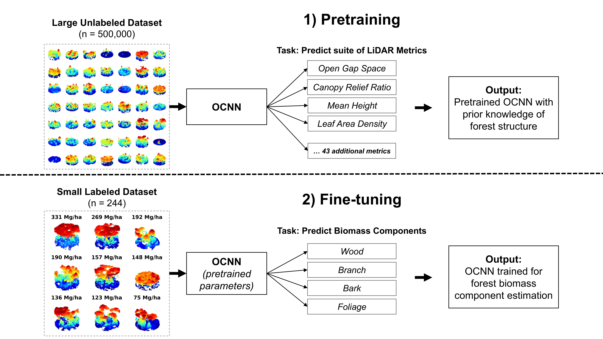
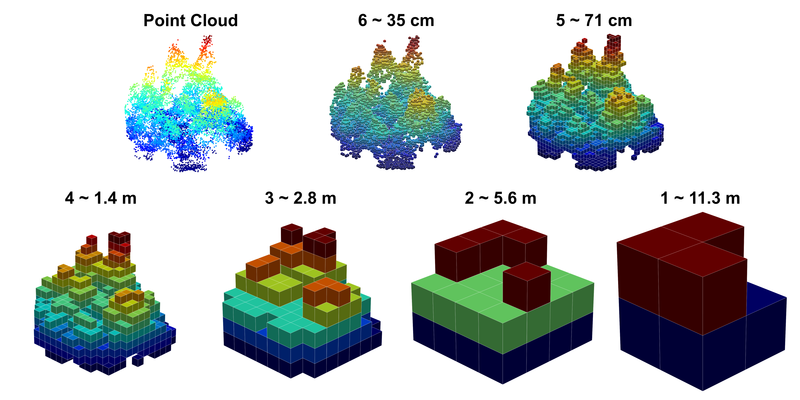

<div style="text-align:center;">
    <h1>Addressing The Small Data Problem in Forestry: Self-Supervised Learning for Aboveground Biomass Estimation</h1>
</div>

<br>

<div style="text-align:center;">
    
</div>

<div style="text-align:center;">
    
</div>

<br>

## Python Environment Setup

**Environment setup is performed using the [uv package manager](https://docs.astral.sh/uv/) which will need to be installed to run the code.**

The uv package manager allows for the installation of specific package versions to maintain reproducibility. The list of packages and their versions is included in the `pyproject.toml` file. A key exception is PyTorch, which requires an environment that can run CUDA 12.4. Read more about using PyTorch with uv in this [documentation](https://docs.astral.sh/uv/guides/integration/pytorch/).

**This code has been tested on Windows 11 and Ubuntu 24.04.2**

1. Open a terminal and check that uv is installed by running 

    ```
    uv
    ```

2. Ensure uv is up-to-date by running

    ```
    uv self update
    ```

3. Clone GitHub repository

    ```
    git clone https://github.com/harryseely/Tree_Biomass_SSL
    ```

4. Intialize the uv environment and install dependencies.

    ```
    uv sync
    ```

## Pretrained Model

The pretrained OCNN weights are provided in the `ocnn_pretrained.ckpt` file. 

Please refer to the `load_checkpoint` method within `models/ocnn_lightning.py` for details regarding loading a model checkpoint.

    
# Acknowledgements

The code used in this study included adapted functions from the [ocnn-pytorch package](https://github.com/octree-nn/ocnn-pytorch). Thanks to Peng-Shuai Wang and the OCNN development team for assistance implementing the model effectively!


